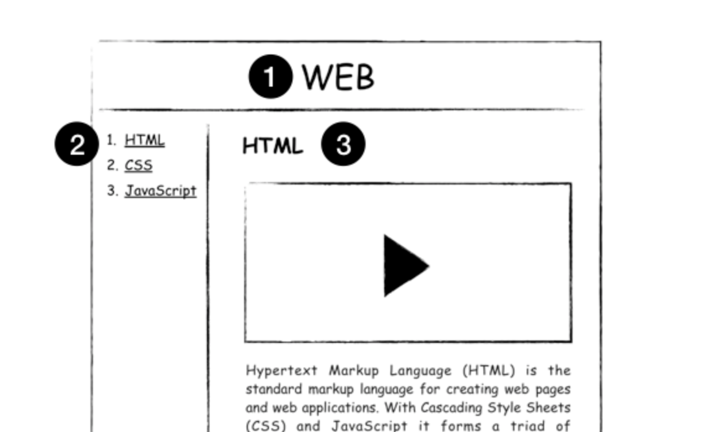

# WEB 1 - Internet & HTML

 

## 00. 커버페이지

[강의](<https://www.opentutorials.org/course/3084>)

이 강의를 어떤 마음가짐으로 이수해나가면 좋을 지에 관하여 설명해주셨다. 희망차고 따뜻한 이고잉님!!😌

- 코딩을 배우려는 학생이 아니라, 코딩으로 문제를 해결하려는 엔지니어를 꿈꾸기. 
- 7년전 이고잉님이 느끼셨던 문제를 '이해'말고 '공감'하며, 같이 고민할 것.
- 우리의 삶과 가까운 생활의 문제를 해결해나가며, 코딩과 친해지고, 흥미 쌓으며 성장해나가기.

 

## 01. 프로젝트의 동기

[강의](<https://www.opentutorials.org/course/3084/18438>)

생활코딩은 이고잉님께서 회사의 비전공자 동료들에게 가르치던 것이, 점점 커져 일반인 강의가 되었고, 이후 지금과 같은 동영상 서비스가 된 것이다. 신경을 많이 써서, 좋은 순서를 지닌 짤막하고 쉬운 강의가 되었다. (감사합니다)

 

## 02. 기획

[강의](<https://www.opentutorials.org/course/3084/18437>)

무엇을 만들기 전에, 무엇을 만들 지 상상하고 기록하는 것. 그것이 기획이다.

 

